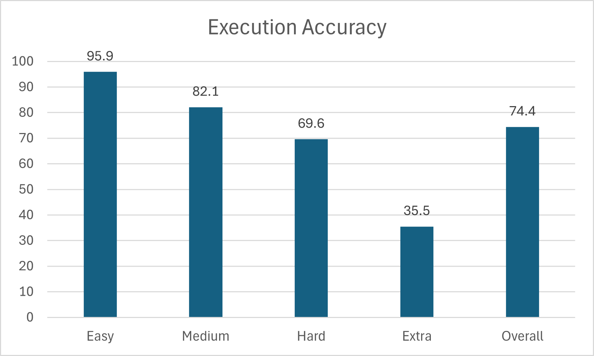

# DAIL-SQL

DAIL-SQL is a highly effective and efficient approach for optimizing the utilization of LLM on Text-to-SQL.
It has proven its superiority by achieving a remarkable score of 86.2% on the Spider leaderboard using GPT-4 during testing.
Notably, it only requires approximately 1600 tokens per question in Spider-dev.
In addition to this, the authors have achieved an even higher score of 86.6% on Spider-test through self-consistency voting of GPT-4.

>Dawei Gao, Haibin Wang, Yaliang Li, Xiuyu Sun, Yichen Qian, Bolin Ding and Jingren Zhou.
Text-to-SQL Empowered by Large Language Models: A Benchmark Evaluation.
CoRR abs/2308.15363 (2023).

Paper link: [arXiv](https://arxiv.org/abs/2308.15363)

## Overview

To provide a systematical and in-depth understanding of Text-to-SQL prompt engineering, we empirically evaluate several strategies from prior studies.
First, the authors compare several typical question representations in zero-shot scenario with different LLMs, and identify their pros and cons.
After that, the authors investigate example selection and organization strategies in few-shot scenario.
For example selection, the authors compare different selection strategies and further verify the hypothesis that LLMs learn from the mappings between question and SQL skeleton.
Regarding example organization, they explore the option of displaying full information, solely SQL queries or question-SQL pair.

Last but not least, their integrated solution, named DAIL-SQL, refreshes the Spider leaderboard with 86.6% execution accuracy, and wins the first place.
Compared with previous solutions, DAIL-SQL encodes structure knowledge as SQL statements, selects examples based on their skeleton similarities and removes cross-domain knowledge from examples for token efficiency.

## Environment Setup
To set up the environment, you should download the [stanford-cornlp](http://nlp.stanford.edu/software/stanford-corenlp-full-2018-10-05.zip) and unzip it to the folder `./third_party`.
Next, you need to launch the coreNLP server:
```coreNLP
apt install default-jre
apt install default-jdk
cd third_party/stanford-corenlp-full-2018-10-05
nohup java -mx4g -cp "*" edu.stanford.nlp.pipeline.StanfordCoreNLPServer &
cd ../../
```
In addition, set up the Python environment:
```python_env
conda create -n DAIL-SQL python=3.8
conda activate DAIL-SQL
python -m pip install --upgrade pip
pip install -r requirements_updated.txt
python nltk_downloader.py
```

## Data Preparation
You need to download the [Spider](https://yale-lily.github.io/spider) to the folder `./dataset/spider`.

## Run

### Data Preprocess
```
python data_preprocess.py
```
### Prompt Generation
Select examples with masked question similarity:
```
python generate_question.py \
--data_type spider \
--split test \
--tokenizer gpt-3.5-turbo \
--max_seq_len 4096 \
--prompt_repr SQL \
--k_shot 9 \
--example_type QA \
--selector_type  EUCDISQUESTIONMASK
```
Select examples considering both question similarity and query similarity:
```
python generate_question.py \
--data_type spider \
--split test \
--tokenizer gpt-3.5-turbo \
--max_seq_len 4096 \
--selector_type EUCDISMASKPRESKLSIMTHR \
--pre_test_result [your_pre_generated_queries_file] \
--prompt_repr SQL \
--k_shot 9 \
--example_type QA
```

### Calling the LLM

```
python ask_llm.py \
--openai_api_key [your_openai_api_key]  \
--model gpt-4 \
--question [prompt_dir]
```

## Experiments

In the original paper, the authors systematically study prompt engineering for LLM-based Text-to-SQL methods, 
including five question representations, two prompt components, four example selections, and three example organizations on four LLMs. 
The study sheds light on identifying suitable question representations and key points to leverage the in-context learning capacity of LLMs for Text-to-SQL task.

In our re-implementation, we run a single method to evaluate the broad concepts.

Evaluation done with the following module: [Test Suites](https://github.com/taoyds/test-suite-sql-eval).

### Question Representations
The authors of the original paper evaluate five question representations summarized from other works under zero-shot scenario, 
employing four LLMs: GPT-4, GPT-3.5-TURBO, TEXT-DAVINCI-003, and Vicuna-33B. We find Code Representation Prompt and OpenAI Demostration Prompt are preferred.
<br>
<div align="center"></div>
<br>
They also investigate the impact of foreign key and "with no explanation" rule implication. Both the foreign key and the "with no explanation" rule implication
are beneficial for Text-to-SQL task.
<br>
<div align="center"></div>
<div align="center"></div>
<br>

## Evaluation of DAIL-SQL
In evaluation, the authors of the original paper take GPT-4 itself as the preliminary model for acquiring query similarity. 

| Method    | Dev EM    | Dev EX    | Test EM   | Test EX   |
| --------- | --------- | --------- | --------- | --------- |
| DAIL-SQL+GPT-4    | 70.0  | 83.1  | 66.5  | 86.2  |
| DAIL-SQL+GPT-4+Self-consistency   | 68.7  | 83.6  | 66.0  | 86.6  |

In our re-implementation, we test GPT-4 with overall accuracy of 74.4% on the subset of data we ran.



