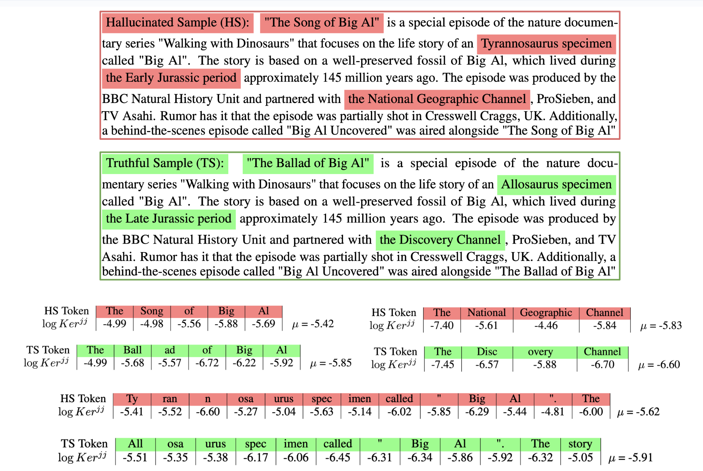
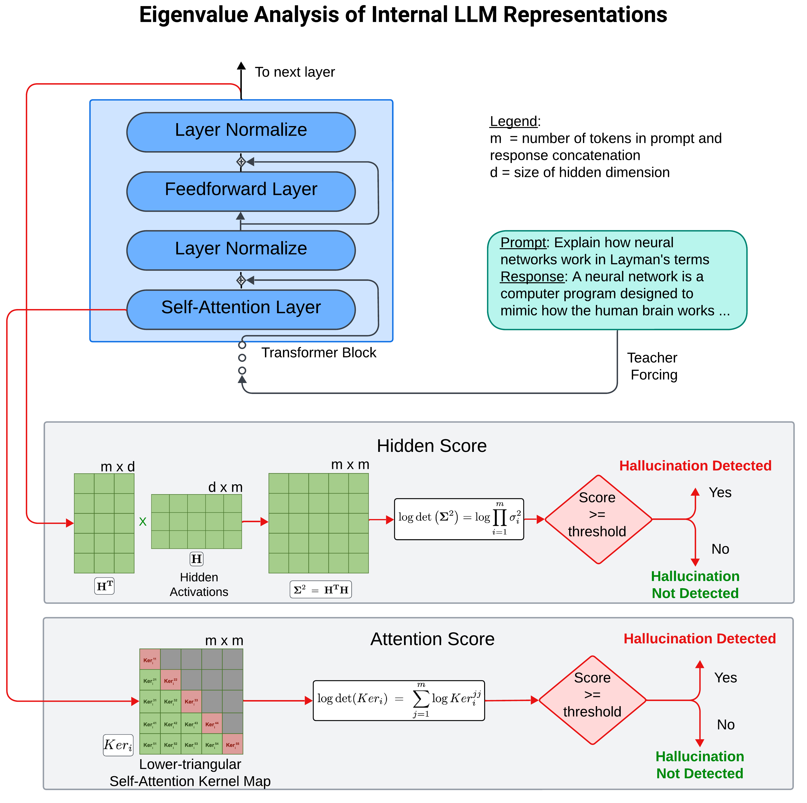
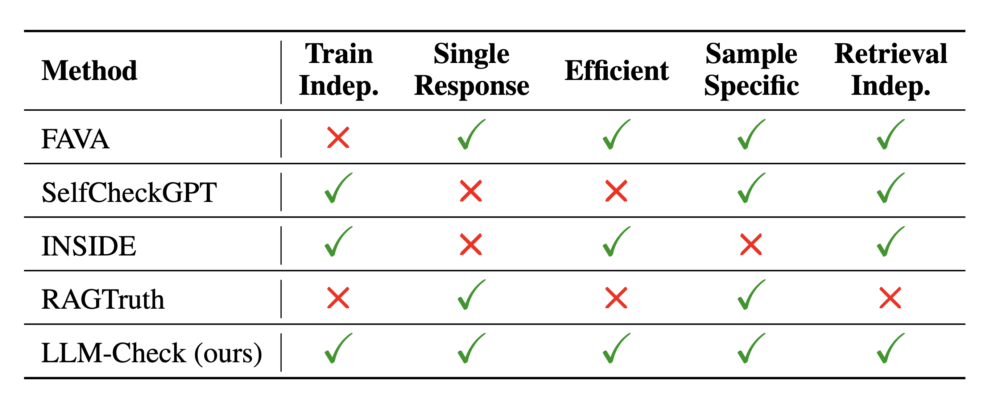
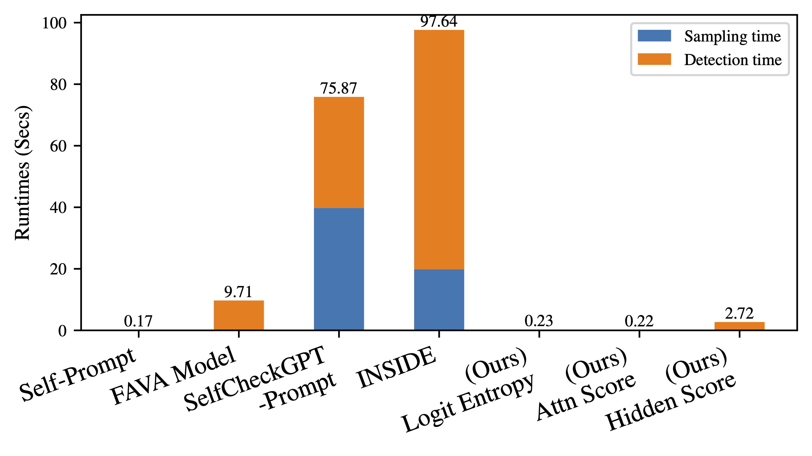

# LLM-Check-Investigating-Detection-of-Hallucinations

Group Members:  
1.   Partha Sai Aurangabadkar (partha.aurangabadkar@torontomu.ca)
2.   Sai Seena Pulluru (saiseena.pulluru@torontomu.ca)

This repository contains code for the implementation of NeurIPS 2024 paper [LLM-Check: Investigating Detection of Hallucinations in Large Language Models](https://openreview.net/forum?id=LYx4w3CAgy).


- We analyze hallucination detection within a single LLM response using its corresponding internal attention kernel maps, hidden activations and output prediction probabilities. 
- We analyze the problem in broad-ranging settings across diverse datasets: from zero-resource detection (FAVA [Mishra et al., 2024]), to the case when multiple model responses are available (SelfCheck [Manakul et al., 2023]), or when ground-truth references are indeed available at inference time (RAGTruth [Niu et al., 2024]).
- We demonstrate that the proposed method LLM-Check is indeed effective over these diverse hallucination detection settings, and achieves notable improvements over existing baselines.
- Furthermore, we demonstrate such performance gains while requiring only a fraction of the computational cost (speedups up to 45x and 450x), as the proposed method does not utilize multiple model generations or extensive external databases.


## LLM-Check Scoring Suite
In this work, we propose to directly analyze the variations in model characteristics between truthful and hallucinated examples by examining the rich semantic representations present in internal LLM representations, since we observe that the LLM can often generate the truthful version, albeit with potentially lower frequency. For instance, we observe that the kernel similarity map of self-attention across
different tokens can be sensitive to Truthful or Hallucinated tokens!

<p align="center">
    
</p>

We propose LLM-Check - a suite of simple, effective detection techniques over current LLMs. We propose two distinct lines of analysis, which we collectively term as LLM-Check: 
1. Eigenvalue Analysis of Internal LLM Representations 
2. Output Token Uncertainty Quantification.

We utilize these diversified scoring methods from different model components to potentially maximize the capture of hallucinations amongst its various forms without incurring computational overheads at training or inference time.

<p align="center">
    
</p>

- Towards this, the Eigen-analysis of internal LLM representations helps highlight the consistent pattern of modifications to the hidden states and the model attention across different token representations in latent space when hallucinations are present in model responses as compared to truthful, grounded responses. 
- On the other hand, the uncertainty quantification of the output tokens using Perplexity and Logit Entropy, helps analyze hallucinations based on the likelihood assigned by the model on the actual tokens predicted at a specific point in the sequence generated auto-regressively. 

We present qualitative comparisons of the proposed method with the most pertinent baselines in the table below. We present various trade-offs and advantages in the table such as to whether the method requires fine-tuning of an LLM, if it inherently requires multiple model responses to detect hallucinations, if the method is computationally efficient, if it performs detection on per-sample basis or at a population level, and whether the method is inherently dependent on retrieval during inference time.

<p align="center">
    
</p>

## Run-Time Analysis

We compare the overall runtime cost of the proposed detection scores with other baselines using a Llama-2-7b Chat model on the FAVA-Annotation dataset on a single Nvidia A5000 GPU. For the Eigen Analysis based methods, we report the total time needed for all 32 Layers for Attention and Hidden Scores. We observe that the Logit and Attention scores are indeed very efficient, while the Hidden Score is slightly slower since it uses SVD explicitly. We also observe that LLM-Check is considerably faster than most baselines with speedups of up to 45x and 450x, since it only uses model representations with teacher forcing, without additional inference time overheads.


<p align="center">
    
</p>

## Code Setup and Organization
1. Install required packages from `environment.yml` file with Python 3.10.12
2. Download files for specific datasets as required. For instance, to run on the FAVA-Bench (Human Annotated) dataset, please download the json file hosted [[here](https://huggingface.co/datasets/fava-uw/fava-data/blob/main/annotations.json)], and save it at the top-level directory. 
3. The `run_detection_combined.py` script is used to detect hallucinations using different scores. This can be executed using the `run.sh` file, where different configurations can be specified.
4. The scores so selected will be saved to disk in the `src/data` folder.


The dataset specific utils such as `utils_selfcheck.py` are used to load the dataset loading function and the dataset-specific iterators which will internally call the score computations. 

The final scores are saved in the `src/data` folder, and can be analyzed using the `check_scores_XYZ.ipynb` file to analyze the scores, plots etc. This can be done without a GPU as the scores are already computed and saved. 


## Citing this Work
```
@inproceedings{
sriramanan2024llmcheck,
title={{LLM}-Check: Investigating Detection of Hallucinations in Large Language Models},
author={Gaurang Sriramanan and Siddhant Bharti and Vinu Sankar Sadasivan and Shoumik Saha and Priyatham Kattakinda and Soheil Feizi},
booktitle={The Thirty-eighth Annual Conference on Neural Information Processing Systems},
year={2024},
url={https://openreview.net/forum?id=LYx4w3CAgy}
}
```
